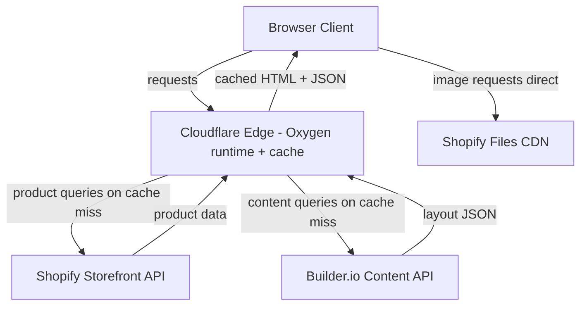
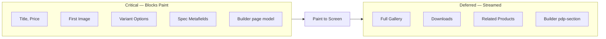

# Veneto — Shopify Hydrogen Storefront Build Plan

## Context

Build a premium Shopify Hydrogen storefront matching the quality of visualcomfort.com. Fresh Hydrogen project, Tailwind CSS, Shopify backend not yet set up. Several thousand products, 3-month timeline. No 3D viewer needed. Core deliverable is a polished product detail page (PDP) with image gallery, variant selectors, specs, and downloadable resources.

**Content/page builder:** [Builder.io](https://www.builder.io/) is the visual CMS for marketing pages, homepage sections, landing pages, and editable content blocks within PDPs/collections. Developers register React components; merchandisers compose pages visually. Shopify remains the source of truth for product, variant, inventory, and cart data — Builder.io does not own commerce data.

---

## Stack

- **Hydrogen** (React Router v7) + **Oxygen** deployment
- **Tailwind CSS v4** with `@theme` design tokens
- **Shopify Storefront API** `2026-01`

**Key added dependencies:**

| Package | Purpose |
|---|---|
| `embla-carousel-react` | Gallery carousel (~3KB gzipped) |
| `react-medium-image-zoom` | Click-to-zoom, SSR-safe (~5KB) |
| `@radix-ui/react-dialog` | Lightbox, cart drawer, mobile nav |
| `@radix-ui/react-tabs` | Product detail tab panel |
| `@radix-ui/react-accordion` | Mobile spec collapse |
| `lucide-react` | Icons |
| `clsx` + `tailwind-merge` | Class name utilities |
| `@formkit/vue` or `@formkit/react` | Form builder + validation, accessible inputs |
| `@builder.io/sdk-react` | Builder.io React SDK for rendering visual content (SSR + RSC friendly) |
| `@builder.io/dev-tools` | Optional: local dev CLI for syncing component registrations |

### Architecture Overview



**Ownership boundaries:**
- **Shopify (source of truth):** products, variants, inventory, pricing, cart, checkout, customer, orders, metafields.
- **Builder.io (source of truth):** marketing pages, hero sections, landing pages, PDP-embedded editorial blocks, navigation promotions, homepage composition.
- **Hydrogen (integrator):** fetches both in the route loader, hydrates Builder content with live Shopify data via symbols/data bindings.

### Page Load Strategy



---

## Builder.io Integration

Builder.io is integrated as a headless visual CMS alongside Shopify. Developers ship React primitives; merchandisers compose them into pages. Routes fall back to Hydrogen-coded templates when no Builder content exists at that URL.

### Content models

Create the following models in Builder.io (Settings → Models):

| Model | Type | URL targeting | Purpose |
|---|---|---|---|
| `page` | Page | `/`, `/about`, `/trade`, `/lookbook/*` | Fully builder-composed marketing pages |
| `homepage` | Page | `/` | Reserved for homepage experimentation/AB |
| `pdp-section` | Section | n/a (embedded by handle) | Optional editorial block on a PDP (e.g., designer story) |
| `collection-hero` | Section | n/a (embedded by handle) | Collection top banner/story |
| `announcement-bar` | Data | global | Site-wide announcement text/link |
| `nav-promo` | Data | global | Mega menu promo tile |

Each model exposes custom targeting fields:
- `pdp-section`: custom field `productHandle` (text) so editors assign a section to a product.
- `collection-hero`: custom field `collectionHandle`.
- `page`: standard URL targeting.

### Environment & config

```
PUBLIC_BUILDER_API_KEY=xxxxxxxxxxxxxxxx   # public key, safe for SSR + client
BUILDER_PRIVATE_KEY=sk_xxxxxxxxxxxxxxxx   # optional: write API / preview bypass
```

Store in `.env` and Oxygen environment variables. Expose only the public key to the client.

### SDK choice

Use `@builder.io/sdk-react` (the Qwik-compatible, framework-agnostic gen-2 SDK). It supports:
- Server rendering inside Hydrogen route loaders.
- Streaming via React Router `defer` + `<Suspense>`.
- Edit-mode detection for in-context preview.
- Works with React Server Components and Cloudflare Workers (Oxygen runtime).

Do **not** use the legacy `@builder.io/react` SDK — it assumes a Node runtime and has heavier client JS.

### File layout

```
app/
├── builder/
│   ├── client.ts              ← initializes builder with PUBLIC_BUILDER_API_KEY
│   ├── registry.ts            ← central component registration (runs on server + client)
│   ├── fetch.ts               ← typed wrappers around builder.get / getAll
│   ├── RenderBuilder.tsx      ← <Content /> wrapper w/ loading + error boundaries
│   └── components/
│       ├── Hero.tsx
│       ├── ProductGrid.tsx    ← pulls live Shopify products by handle list
│       ├── CollectionGrid.tsx
│       ├── ImageWithCaption.tsx
│       ├── TwoColumnEditorial.tsx
│       └── DesignerQuote.tsx
└── routes/
    ├── ($locale)._index.tsx              ← homepage via Builder `page` model
    ├── ($locale).pages.$.tsx             ← catch-all Builder `page` pages
    ├── products.$handle.tsx              ← Shopify PDP + embedded `pdp-section`
    └── collections.$handle.tsx           ← Shopify collection + embedded `collection-hero`
```

### Initialization

`app/builder/client.ts`:

```ts
import { builder } from '@builder.io/sdk-react';

export function initBuilder(apiKey: string) {
  builder.init(apiKey);
  // enable caching at the SDK layer; we layer Oxygen cache on top
  builder.canTrack = true;
}
```

Call `initBuilder(env.PUBLIC_BUILDER_API_KEY)` once inside the server entry (`server.ts`) and once on the client entry (`entry.client.tsx`). The registry import must run in both places so components resolve on server render and on edit-mode re-renders.

### Registering custom components

Builder editors can only drag components that are registered. `app/builder/registry.ts`:

```ts
import { Builder } from '@builder.io/sdk-react';
import { Hero } from './components/Hero';
import { ProductGrid } from './components/ProductGrid';

Builder.registerComponent(Hero, {
  name: 'Hero',
  inputs: [
    { name: 'eyebrow', type: 'string' },
    { name: 'heading', type: 'string', required: true },
    { name: 'body', type: 'richText' },
    { name: 'image', type: 'file', allowedFileTypes: ['jpeg', 'png', 'webp'] },
    { name: 'cta', type: 'object', subFields: [
      { name: 'label', type: 'string' },
      { name: 'href', type: 'url' },
    ]},
    { name: 'align', type: 'string', enum: ['left', 'center'], defaultValue: 'left' },
  ],
  image: 'https://cdn.builder.io/.../hero-preview.svg',   // thumbnail in insert menu
  defaultStyles: { paddingTop: '80px', paddingBottom: '80px' },
});

Builder.registerComponent(ProductGrid, {
  name: 'ProductGrid',
  inputs: [
    { name: 'heading', type: 'string' },
    { name: 'productHandles', type: 'list', subFields: [
      { name: 'handle', type: 'string', required: true },
    ]},
    { name: 'columns', type: 'number', defaultValue: 4, enum: [2, 3, 4] },
  ],
});
```

`ProductGrid` receives `productHandles` from Builder, then on the server fetches live data from the Storefront API in its own loader (or via a parent loader that passes a `productsByHandles` prop). Editors never touch price/inventory — they only curate which handles render.

### Route: catch-all Builder pages

`app/routes/($locale).pages.$.tsx` (or `app/routes/$.tsx`):

```tsx
import { defer, type LoaderFunctionArgs } from '@shopify/remix-oxygen';
import { Content, fetchOneEntry } from '@builder.io/sdk-react';
import { CacheLong } from '@shopify/hydrogen';

export async function loader({ request, context }: LoaderFunctionArgs) {
  const url = new URL(request.url);
  const urlPath = url.pathname;

  const content = await context.withCache(
    ['builder-page', urlPath],
    CacheLong(),
    () =>
      fetchOneEntry({
        model: 'page',
        apiKey: context.env.PUBLIC_BUILDER_API_KEY,
        userAttributes: { urlPath },
        options: { includeRefs: true },
      }),
  );

  if (!content) throw new Response('Not Found', { status: 404 });

  return defer({ content, apiKey: context.env.PUBLIC_BUILDER_API_KEY });
}

export default function BuilderPageRoute() {
  const { content, apiKey } = useLoaderData<typeof loader>();
  return (
    <Content
      model="page"
      content={content}
      apiKey={apiKey}
      customComponents={customComponents}
    />
  );
}
```

The catch-all runs **after** Shopify product/collection routes so `/products/*` and `/collections/*` win. For full 404 control, check for a Builder match first in a root resource route and short-circuit if found.

### Embedding Builder sections inside Shopify routes

On `products.$handle.tsx` the loader fetches a `pdp-section` targeted at the product handle. If found, render it below the spec tabs; otherwise render nothing.

```tsx
const editorialPromise = fetchOneEntry({
  model: 'pdp-section',
  apiKey: context.env.PUBLIC_BUILDER_API_KEY,
  userAttributes: { productHandle: params.handle },
});

return defer({
  product: await criticalProduct,          // critical
  editorial: editorialPromise,             // deferred
});
```

In the component tree:

```tsx
<Suspense fallback={null}>
  <Await resolve={editorial}>
    {(entry) => entry ? (
      <Content model="pdp-section" content={entry} apiKey={apiKey} customComponents={customComponents} />
    ) : null}
  </Await>
</Suspense>
```

### Data binding Shopify → Builder

Two approaches; use both where appropriate:

1. **Handle-list curation (simpler):** editor picks product handles via a `list` input; the React component fetches Shopify data server-side. Best for curated grids, featured cards.
2. **Builder Data Connections (advanced):** register a custom data plugin that exposes Shopify collections/products as selectable data sources inside the editor. Lets editors bind *any* text/image field to a Shopify field (e.g., `{{state.product.title}}`). Requires shipping a small plugin in `plugins/builder-shopify/` — defer to Phase 4 unless merchandisers demand it.

### Preview & edit mode

Builder.io visual editor iframes the live site with `?builder.preview=<model>&builder.space=<key>`. To support this:

- Do **not** gate content fetching on `NODE_ENV`; fetching must work in production preview too.
- Pass `canTrack` and allow the editor origin in CSP (`frame-ancestors https://builder.io https://*.builder.io`).
- When `url.searchParams.get('builder.preview')` is present, skip Oxygen cache (`CacheNone()`) so edits appear immediately.
- Set a dedicated preview URL in Builder space settings: `https://preview.veneto.example.com` pointing to a preview deployment or Oxygen preview branch.

### Caching strategy

| Content | Cache | TTL | Notes |
|---|---|---|---|
| Builder `page` | `CacheLong` | 1h SWR | bust via webhook on publish |
| Builder `pdp-section` | `CacheShort` | 60s | aligned with product cache |
| Builder `announcement-bar` | `CacheShort` | 60s | global, root loader |
| Preview mode | `CacheNone` | — | detected via `builder.preview` query |

Register a Builder webhook → Oxygen cache purge endpoint on `content.publish` to invalidate keys immediately rather than waiting for TTL.

### Image handling — Shopify CDN is the asset store

**Decision:** Shopify's Files CDN is the single image store for the site. Builder.io is used purely as a drag-and-drop page composer, not as an asset host. Rationale:

- One asset pipeline (Shopify Files) — merchandisers already upload product and brand imagery there.
- Consolidated billing and bandwidth on Shopify; no second CDN to monitor or pay for.
- Hydrogen's `<Image>` component (from `@shopify/hydrogen`) already generates responsive `srcset`, `sizes`, and WebP variants against Shopify's transform API.
- Avoids cross-origin preconnect/DNS-prefetch overhead from a second image host.
- Marketing imagery and product imagery share the same `loading`, `fetchpriority`, and LCP rules.

**How it works in Builder components:**
- Editors pick images via a custom `type: 'reference'` input wired to Shopify Files, **not** Builder's default `type: 'file'` uploader. The input stores a Shopify file GID (e.g., `gid://shopify/GenericFile/12345`).
- On render, the component resolves the GID → `image.url` via the Storefront API in the route loader and passes it to Hydrogen's `<Image>`.
- Shortcut for MVP: use a `type: 'string'` input with a clear label like "Shopify CDN URL" so editors paste a `cdn.shopify.com/...` URL copied from the admin, and render it through Hydrogen's `<Image>` with `loaderUrl`.
- Disable Builder's built-in image block in the editor (via `Builder.register('editor.settings', { hideComponents: ['Image'] })`) so editors cannot bypass Shopify and upload straight to Builder's CDN.

Result: Builder owns layout, copy, and composition. Shopify owns every pixel that ships to a browser.

### Type safety

Generate TypeScript types for each model's inputs from `registry.ts` so loader code gets autocomplete on `content.data`:

```ts
type HeroProps = { 
    eyebrow?: string; 
    heading: string; 
    body?: string; 
    image?: string; 
    cta?: { 
        label: string; 
        href: string 
    }; 
    align?: 'left' | 'center' 
};
```

Co-locate the type next to the component and export it. Builder returns `content.data.blocks` untyped; narrow at the component boundary.

### Accessibility guardrails

Editors can insert arbitrary blocks, so the component library must fail safe:
- Every registered component renders semantic HTML (`<section>`, `<h2>`, `<figure>`) — editors cannot downgrade to `<div>` soup.
- Image inputs require `alt` text (mark as required in `inputs` config).
- Heading-level inputs are constrained via `enum: ['h2', 'h3']` — the PDP always owns `h1`.
- Color inputs come from a Tailwind token palette (restrict via `enum`) so contrast stays AA.
- axe scan runs against Builder-authored pages in CI via a preview URL list.

### Phased rollout

| Phase | Builder scope |
|---|---|
| Phase 1 | SDK installed, `announcement-bar` + `nav-promo` data models, registry scaffolded |
| Phase 2 | `pdp-section` model + 2–3 PDP editorial blocks (designer quote, installation gallery) |
| Phase 3 | `collection-hero` model, 4–5 collection blocks |
| Phase 4 | `page` catch-all route, homepage migrated to Builder, marketing enabled for landing pages |

### Phase-specific verification

- Component registration works on server (check SSR HTML contains component output, not fallback).
- Edit mode loads the live site in Builder iframe, drag-drop a Hero, preview renders.
- Publish a page → webhook fires → Oxygen cache purged → new content visible within 5s.
- axe scan on a Builder-authored homepage shows 0 violations.
- Bundle size: Builder SDK + custom components < 40KB gzipped added to the route.

---

## Phase 1 — Foundation (Weeks 1–4)

### Init

```bash
npx create-hydrogen-app@latest veneto
# Select: Tailwind CSS, TypeScript, Oxygen
npm install axe-core @testing-library/react vitest
```

### Design tokens (`app/styles/app.css`)

```css
@theme {
  --font-display: 'Cormorant Garamond', Georgia, serif;
  --font-body: 'Inter', system-ui, sans-serif;
  --color-canvas: #FAF9F7;
  --color-text-primary: #1A1A1A;
  --color-text-muted: #6B6B6B;
  --color-accent: #8B7355;
  --color-border: #E8E6E2;
}
```

**A11y token checks:** All text must pass WCAG AA contrast (4.5:1 for body, 3:1 for large). Verify in DevTools.

### Layout shell

- `app/components/layout/Header.tsx` — logo, center nav, icons
- `app/components/layout/MegaMenu.tsx` — hover category panel (keyboard accessible, `aria-expanded`, focus trap)
- `app/components/layout/MobileNav.tsx` — Radix Dialog slide-in (built-in a11y)
- `app/components/layout/CartDrawer.tsx` — slide-in cart (Radix Dialog, focus management)
- `app/components/forms/SearchForm.tsx` — FormKit search input with validation
- `app/components/forms/NewsletterForm.tsx` — FormKit email signup with validation

**A11y requirements:**
- Skip link to main content (`#main`)
- Header nav keyboard-navigable (Tab through links, Enter to open MegaMenu)
- MegaMenu: `aria-label="Main navigation"`, `role="navigation"`, focus trap with `FocusScope` from Radix
- Cart drawer: focus returned to trigger button on close
- Font preload for FOUT mitigation
- FormKit forms: auto-generate accessible inputs with `<label>`, error messages with `aria-live`, validation on blur/submit

Root loader queries nav menus from Storefront API via `menu(handle: "main-menu")`.

**Cache strategy:** `CacheShort()` for products (60s), `CacheLong()` for collections (1hr), `CacheNone()` for cart/search.

**Phase 1 verification:** 
- `npm run dev` runs, header/footer render, Tailwind tokens resolve
- axe scan passes on header/footer components (0 violations)
- Tab order is logical through all interactive elements
- Contrast check: all text AA or AAA

---

## Phase 2 — Product Page (Weeks 5–9)

**Critical file:** `app/routes/products.$handle.tsx`

### Loader pattern (critical + deferred split)

- **Critical (blocks paint):** title, price, selected variant, first image, options, spec metafields
- **Deferred (streamed):** full media gallery, download files, related products

### Component tree

```
products.$handle.tsx
└── <ProductPage>
    ├── <ProductGallery>
    │   ├── <GalleryMain>          ← primary image + react-medium-image-zoom
    │   ├── <GalleryThumbnailRail> ← embla carousel, keyboard-navigable
    │   └── <GalleryLightbox>      ← Radix Dialog, full-res, focus trap
    ├── <ProductInfo>
    │   ├── <ProductHeader>        ← title, designer, collection name (proper heading hierarchy)
    │   ├── <ProductPrice>
    │   ├── <VariantSelector>      ← swatches (<8 options) or dropdown (≥8), aria labels
    │   ├── <AddToCartButton>      ← focus-visible style, aria-label for icon buttons
    │   └── <StockIndicator>       ← aria-live="polite" for status updates
    ├── <ProductDetailTabs>        ← Radix Tabs (native a11y)
    │   ├── Description            ← semantic HTML
    │   ├── Specifications         ← <SpecsTable>
    │   └── Downloads              ← <DownloadList>
    └── <RelatedProducts>          ← Suspense + deferred
```

**A11y patterns:**
- All buttons have visible focus states (`:focus-visible`)
- Interactive elements have `aria-label` / `aria-describedby` as needed
- Form inputs have associated `<label>`
- Headings follow semantic order (no skipped levels)
- Images have meaningful `alt` text (product name + finish)
- Icons paired with text (no icon-only buttons without labels)

### Variant selector

Use `getProductOptions` and `useOptimisticVariant` from `@shopify/hydrogen`. Swatches use `optionValues.swatch.color` (native Shopify, API 2024-01+). 

**A11y:** Swatch buttons need `aria-label` (e.g., "Select Aged Iron finish") + `aria-current="true"` for selected. Unavailable combos: `aria-disabled="true"`, not `hidden`. Dropdown: `<select>` is natively accessible.

### Gallery behavior

- Desktop: main image left (60%), info right (40%). Thumbnail rail below main image.
- Mobile: full-width embla carousel, tap opens Radix Dialog lightbox.
- Variant switch: scroll gallery to matching `media` node by `variantImage.id`.
- Images: always use Hydrogen `<Image>` component for CDN URL generation.

**A11y:** Carousel uses `role="region"` + `aria-label="Product gallery"`. Thumbnail buttons have `aria-label`. Lightbox: focus trap, `aria-modal="true"`, close button accessible. Images use Hydrogen's `alt` text.

### Specs table

Metafields stored as JSON, parsed into `<dl>` definition list. Groups: Dimensions, Electrical, Mounting, Certifications. Mobile: Radix Accordion.

**A11y:** `<dl>` preserves semantic structure for screen readers. Accordion: Radix handles `aria-expanded`, `aria-controls`, focus management.

### Downloads

`GenericFile` references from Shopify Files CDN. Render as `<a download>` with file type icon, label, file size.

**A11y:** Links have descriptive text (not just "Download"). File type icons include `aria-label` or are purely decorative (SVG with `aria-hidden`). `rel="noreferrer"` for external links.

**Phase 2 verification:**
- Lighthouse mobile > 85, LCP < 2.5s from Oxygen preview URL, accessibility score 90+
- axe scan: 0 violations, 0 warnings on product page
- Keyboard nav: Tab through entire page, all buttons/links reachable
- Screen reader test: VoiceOver/NVDA reads all spec groups, downloads, variant options correctly
- Zoom opens/closes without layout shift
- Color contrast AA on all text + swatch labels
- Focus indicators visible on all interactive elements
- Tab order is logical (left column gallery → right column form → bottom related products)

---

## Phase 3 — Collection Pages (Weeks 10–11)

**File:** `app/routes/collections.$handle.tsx`

- Pagination: `getPaginationVariables(request, { pageBy: 24 })` + Intersection Observer infinite scroll
- Faceted filtering via Shopify's native `productFilters` (renders as Radix Accordion sidebar)
- Product card: `4/5` portrait, hover second-image crossfade, finish count badge

**A11y:**
- Filter sidebar: Radix Accordion (built-in a11y), `aria-label="Filters"`, checkboxes have associated labels
- Infinite scroll: aria-live region announces "Loaded X more products"
- Product cards: heading hierarchy (h3), links have focus-visible, `alt` text on product images
- No hover-only information — all info visible on keyboard/touch

---

## Phase 4 — Polish & Launch (Weeks 12–13)

- Homepage sections: hero, featured collections, new arrivals (semantic HTML, proper heading structure)
- Search: FormKit search form with `predictiveSearch` (type-ahead) + `search` query (results page)
- Contact/inquiry form: FormKit with validation, email notification
- Newsletter signup: FormKit email form with Klaviyo/Mailchimp integration
- Structured data: `Product` JSON-LD on all PDPs
- Sitemap: split into `sitemap-products-1.xml` etc. for scale
- **A11y pass:** axe scan all routes (0 violations), Lighthouse 90+ accessibility score, keyboard navigation test on all interactive elements, screen reader test (VoiceOver/NVDA on key flows), FormKit form testing (validation messages, error states, focus management)
- Oxygen production deploy

---

## Shopify Metafield Schema (agree with backend before data entry)

### `specs` namespace (product-level)
| Key | Type |
|---|---|
| `dimensions` | `json` — `{ height, width, extension, backplate_w, backplate_h }` |
| `electrical` | `json` — `{ socket_type, max_wattage, bulb_type, num_sockets }` |
| `mounting` | `json` — `{ type, canopy_w, canopy_h }` |
| `weight` | `number_decimal` |
| `rating` | `single_line_text_field` — e.g. "ETL Listed, Wet" |

### `product` namespace
| Key | Type |
|---|---|
| `designer` | `single_line_text_field` |
| `collection` | `single_line_text_field` |
| `style` | `list.single_line_text_field` |

### `downloads` namespace
| Key | Type |
|---|---|
| `spec_sheet` | `file_reference` → `GenericFile` |
| `installation_guide` | `file_reference` → `GenericFile` |
| `cad_dwg` | `file_reference` → `GenericFile` |

Use `file_reference` type (not URL strings) — stores in Shopify CDN, returns `.url`, `.mimeType`, `.fileSize` via Storefront API.

---

## Critical Files

| File | Purpose |
|---|---|
| `app/styles/app.css` | All design tokens via `@theme` |
| `app/routes/products.$handle.tsx` | PDP route — loader, deferred, composition |
| `app/components/product/ProductGallery.tsx` | embla + zoom + lightbox |
| `app/components/product/VariantSelector.tsx` | Swatches, dropdowns, optimistic variant |
| `app/components/product/SpecsTable.tsx` | Metafield JSON → definition list |
| `app/components/product/DownloadList.tsx` | GenericFile links |
| `app/routes/collections.$handle.tsx` | Collection + filters + infinite scroll |
| `app/components/layout/Header.tsx` | Nav shell |
| `app/components/forms/SearchForm.tsx` | FormKit search with validation |
| `app/components/forms/NewsletterForm.tsx` | FormKit newsletter signup |
| `app/components/forms/ContactForm.tsx` | FormKit contact inquiry (if needed) |

---

## A11y Testing Checklist (Throughout All Phases)

- **Automated:** axe-core scans on every route (CI integration optional)
- **Keyboard:** Tab through entire page, Enter/Space activate buttons, Escape closes modals, Tab through form fields
- **Screen reader:** Test with NVDA (Windows) or VoiceOver (Mac) on: product page, collection filters, search results, forms (label association, error announcement)
- **Color contrast:** Use WebAIM contrast checker on all text + interactive elements (AA minimum)
- **Focus indicators:** All interactive elements have visible `:focus-visible` state (not just `:focus`)
- **Motion:** Test with `prefers-reduced-motion` media query (no auto-play carousels)
- **Zoom:** Test at 200% zoom, page layout doesn't break, form inputs remain usable
- **Touch:** All clickable areas ≥44×44px (WCAG 2.1 AAA)
- **FormKit:** Error messages are announced via `aria-live`, form validation doesn't break keyboard nav, labels are associated with inputs

---

## Performance Notes

- Never use `first: 250` on collections — use cursor pagination (24/page)
- `fetchpriority="high"` on above-fold product image
- All product card images: `loading="lazy"`, `sizes="25vw"` desktop
- Total added JS over scaffold: < 20KB gzipped
- A11y doesn't negatively impact performance — use semantic HTML, avoid JS-heavy widgets, let Radix handle focus management
